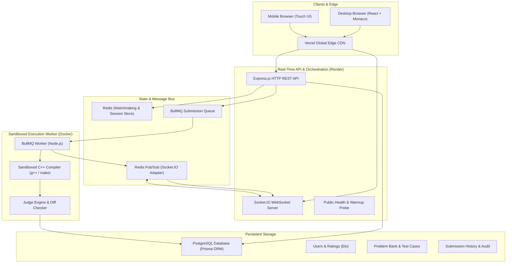
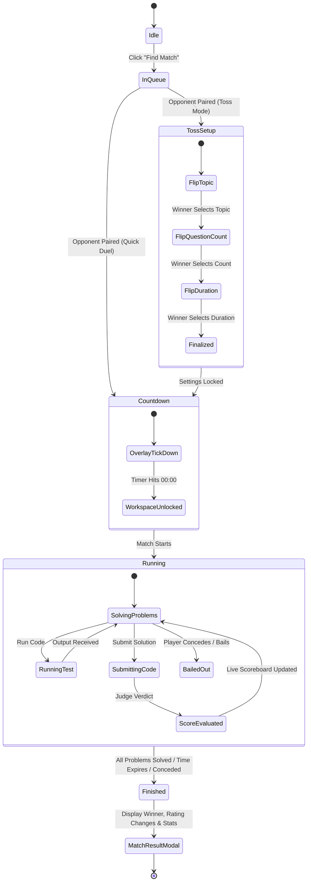

<div align="center">

# ⚔️ CodeArena
### Real-Time 1v1 Competitive Programming Esports Platform

[](https://vitejs.dev/)
[](https://react.dev/)
[](https://nodejs.org/)
[](https://socket.io/)
[](https://redis.io/)
[](https://bullmq.io/)
[](https://www.postgresql.org/)
[](https://www.docker.com/)

<p align="center">
  <strong>Transforming algorithmic problem solving from an isolated grind into high-stakes, real-time 1v1 esports duels.</strong>
</p>

[Explore Features](#-key-features) • [System Architecture](#-system-architecture) • [Contest Lifecycle](#-contest-lifecycle) • [Sandboxed Execution](#-sandboxed-judge-pipeline) • [Quick Start](#-quick-start)

---

</div>

## 🌟 Product Overview

**CodeArena** is a production-ready, multiplayer competitive programming platform designed for software engineers, competitive coders, and technical interview candidates. 

Unlike traditional platforms where users solve problems in isolation, CodeArena introduces **gamified head-to-head combat**:
- Match against peers of similar rating in seconds.
- Compete in innovative modes like **Interactive Coin-Toss Setup**, where players duel in coin flips to dictate the match topic, question count, and time constraints.
- Code in a low-latency, VS Code-grade Monaco workspace with real-time test case verification.
- Experience live score updates, penalty deductions, and spectator-grade event feeds powered by sub-millisecond Redis pub/sub and WebSocket channels.

---

## ⚡ Key Features

### ⚔️ Real-Time 1v1 Duels
- **Instant Matchmaking**: Dynamic queue pairing users based on rating and skill brackets.
- **Toss Match Mode**: Interactive pre-match coin flips determine which player selects the problem category (Arrays, DP, Graphs, etc.), total problem count (1 to 3), and duration per problem.
- **Atomic Scoring Engine**: Redis Lua scripts ensure race-condition-free scoring, allocating dynamic points based on completion speed while docking penalties for failed attempts.

### 💻 Elite Arena Workspace
- **Monaco Editor Integration**: Full syntax highlighting, intelligent indentation, bracket matching, and shortcuts (`Ctrl+Enter` to Submit, `Ctrl+Shift+Enter` to Run, `Ctrl+S` to Test).
- **Per-Problem State Isolation**: Jump between multiple problems during a match with zero state leakage—code, test outputs, and console logs are strictly preserved per problem.
- **Collapsible Split Panes**: Drag-and-resize panels for Problem Statement, Code Editor, and Execution Terminal.

### 🛡️ Sandboxed Judge Engine
- **Isolated Execution**: Custom Dockerized C++ compiler worker isolated from the main web application.
- **Instant Verdicts**: Detailed feedback on compilation errors, sample tests, runtime limits (`TLE`), memory overflow (`MLE`), and runtime exceptions (`RTE`).
- **Distributed Queue Architecture**: Submissions are scheduled via BullMQ over Redis, preventing traffic spikes from degrading API responsiveness.

### 📱 Responsive Mobile Experience
- **Adaptive Mobile Workspace**: Replaces squeezed split panes with a seamless segmented 3-tab layout (`Problem`, `Editor`, `Console`).
- **Mobile Battle View**: Dedicated `Battle` tab to inspect opponent status, live scoreboard, and event feed during mobile matches.
- **Slide-out Navigation Drawer**: Touch-optimized drawer for profile navigation, matchmaking, and rating overview.

### 🔒 Enterprise Protection & Cold-Start Management
- **Site Access Gatekeeper**: Configurable client-side gate protecting production preview deployments from unauthorized API consumption.
- **Smart Cloud Warmup Manager**: Background WebSocket & HTTP health check probes that proactively wake sleeping Render free-tier containers without blocking active users.

---

## 🏗️ System Architecture

CodeArena employs a modern, distributed micro-architecture separating the real-time API layer from the heavy, isolated code compilation and evaluation worker.



---

## 🔄 Contest Lifecycle

A CodeArena multiplayer match transitions through a resilient state machine governed by WebSocket events and backend synchronization.



---

## ⚡ Sandboxed Judge Pipeline

When a player hits **Submit**, the code travels through an asynchronous, distributed execution pipeline designed for reliability and zero main-thread blocking:

```mermaid
sequenceDiagram
    autonumber
    actor Player as Player (Frontend)
    participant API as Express API
    participant DB as PostgreSQL
    participant Redis as Redis / BullMQ
    participant Worker as Judge Worker (Docker)
    participant Sockets as Socket.IO Emitter
    actor Opponent as Opponent (Frontend)

    Player->>API: POST /api/submissions (code, language, problemId)
    API->>DB: Insert submission (status: 'queued')
    API->>Redis: Enqueue Job into 'judge' queue
    API-->>Player: Return submissionId

    Redis->>Worker: Dequeue Job (submissionId, code, problemId)
    Worker->>DB: Update status to 'running'
    
    rect rgb(20, 20, 30)
        Note over Worker: Sandboxed Execution
        Worker->>Worker: Write source to tmp file
        Worker->>Worker: Compile with g++ (-O3, standard limits)
        Worker->>Worker: Run against public & hidden test cases
        Worker->>Worker: Measure CPU time & Memory consumption
        Worker->>Worker: Compute Verdict (Accepted, WA, TLE, CE)
    end

    Worker->>DB: Update submission (verdict, executionTimeMs, status: 'completed')
    
    alt If Verdict == 'Accepted' in a Live Match
        Worker->>Redis: Execute Lua Script (atomic score update & penalty check)
        Worker->>Sockets: Emit 'SCORE_UPDATED' to Match Room
        Sockets-->>Player: Update Live Scoreboard & Problem Dot (Green)
        Sockets-->>Opponent: Update Opponent Score & Match Event Feed
    end

    Player->>API: Poll /api/submissions/:id
    API-->>Player: Return completed verdict & execution metrics
```



---

## 🧮 Atomic Lua Scoring Algorithm

To avoid race conditions and double-awarding of points when multiple players submit simultaneously, CodeArena processes all contest scores using an **atomic Redis Lua script**:

- **Base Score**: 100 points per solved problem.
- **Wrong Submission Penalty**: 5 points deducted per failed attempt prior to an `Accepted` verdict (minimum floor of 50 points).
- **Idempotency Guarantee**: Submitting an already-solved problem never increments points or deducts penalties.
- **Instant Finalization**: When a player reaches the designated problem target, the Lua script atomically transitions the match state to `finished`, sets the winner, and triggers the `MATCH_FINISHED` socket broadcast.

---

## 🛠️ Technology Stack

| Domain | Technology | Purpose |
|---|---|---|
| **Frontend Framework** | React 18 + Vite | Blazing fast client bundle with hot module replacement |
| **Styling & Motion** | TailwindCSS + Framer Motion | Cyberpunk-inspired dark aesthetic with micro-interactions |
| **Code Editor** | Monaco Editor (`@monaco-editor/react`) | VS Code-grade code editing, custom themes, and keybindings |
| **Client State** | React Query + Zustand | Server state caching, matchmaking store, and theme persistence |
| **API & Routing** | Express.js (Node.js 20) | REST API endpoints for problems, submissions, auth, and users |
| **Real-Time Layer** | Socket.IO + Redis Emitter | Multi-room socket synchronization with Redis backplane |
| **Job Queue** | BullMQ + Redis Cloud | Asynchronous distributed queue managing judge evaluations |
| **Database & ORM** | PostgreSQL + Prisma ORM | Relational persistence for users, matches, problems, and test cases |
| **Execution Sandbox** | Docker + Debian Bookworm + GCC | Isolated container compiling and benchmarking C++ solutions |
| **Hosting & CDN** | Vercel (Frontend) + Render (Backend & Worker) | Global edge hosting with automatic cold-start orchestration |

---

## 🚀 Quick Start

### Prerequisites
- [Node.js](https://nodejs.org/) v18 or higher
- [Docker Desktop](https://www.docker.com/) (for local judge worker)
- [PostgreSQL](https://www.postgresql.org/) database
- [Redis](https://redis.io/) server (local or Redis Cloud instance)

### 1. Clone the Repository
```bash
git clone https://github.com/Siddharth-Jaswal/Coding-Arena.git
cd Coding-Arena
```

### 2. Backend Setup
```bash
cd backend
npm install

# Copy environment variables
cp .env.example .env

# Generate Prisma Client & Run Migrations
npx prisma generate
npx prisma migrate dev

# Seed Problem Bank
npm run seed:problems

# Start API Server
npm run dev
```

### 3. Judge Worker Setup
You can run the judge worker locally via Node or containerized via Docker:

```bash
# Option A: Run directly with Node.js (requires g++ installed on your machine)
node src/workers/submissionWorker.js

# Option B: Run in isolated Docker container
docker build -t codearena-worker .
docker run --network host --env-file .env codearena-worker
```

### 4. Frontend Setup
```bash
cd ../frontend
npm install

# Copy environment variables
cp .env.example .env

# Start Frontend Dev Server
npm run dev
```
Open [http://localhost:5173](http://localhost:5173) in your browser.

---

## 🌐 Environment Configuration

CodeArena supports **Instant Environment Switching** (`mode='prod' | 'local'`) so the frontend and backend can toggle seamlessly between local containers and cloud services:

```env
# Set to 'local' for local development or 'prod' for deployed Render backend
VITE_APP_MODE=local

# Access Protection (Optional password gate on Vercel preview)
VITE_SITE_ACCESS_PASSWORD=

# Local Backend URLs
VITE_LOCAL_API_URL=http://localhost:5000
VITE_LOCAL_WS_URL=http://localhost:5000

# Cloud Backend URLs (Render)
VITE_PROD_API_URL=https://codearena-api.onrender.com
VITE_PROD_WS_URL=https://codearena-api.onrender.com
```

---

## 🗺️ Product Roadmap

- [x] **Milestone 1**: Core Problem Bank, Filter & Pagination Engine
- [x] **Milestone 2**: Monaco-powered Arena Workspace with split-pane layout
- [x] **Milestone 3**: JWT Authentication, User Profiles, Elo Ratings & Match Statistics
- [x] **Milestone 4**: Real-time 1v1 Ranked Matchmaking & Toss Coin-Flip Mode
- [x] **Milestone 5**: Distributed Dockerized Judge Engine with BullMQ & Redis
- [x] **Milestone 6**: Mobile-responsive segmented navigation & esports live feed
- [ ] **Milestone 7**: Custom Private Rooms & Spectator Broadcasting
- [ ] **Milestone 8**: Multi-Language Support (Python 3, Java 21, Rust)
- [ ] **Milestone 9**: Guilds, Tournaments & Weekly Scheduled Clan Cups

---

## 🤝 Contributing

Contributions, issues, and feature suggestions are welcome!
1. Fork the Project
2. Create your Feature Branch (`git checkout -b feature/AmazingFeature`)
3. Commit your Changes (`git commit -m 'Add some AmazingFeature'`)
4. Push to the Branch (`git push origin feature/AmazingFeature`)
5. Open a Pull Request

---

## 📄 License

Distributed under the MIT License. See `LICENSE` for more information.

<div align="center">
  <sub>Built with ❤️ by Siddharth Jaswal for competitive programmers worldwide.</sub>
</div>
